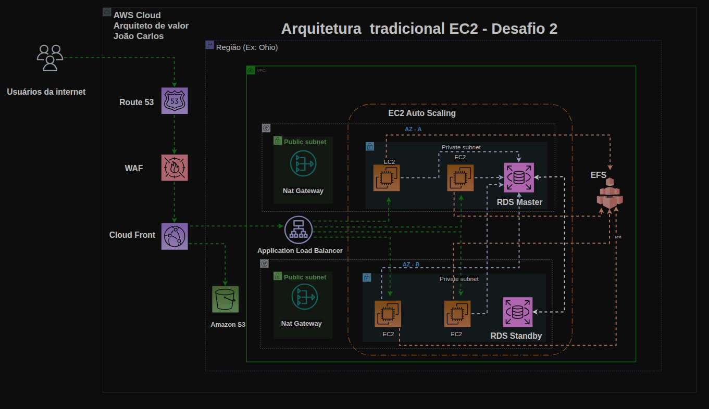

# 🏗️ AWS Arquitetura Completa com Terraform (Cloud + DevOps)

## 📊 Diagrama da Arquitetura



Diagrama representando a arquitetura provisionada via Terraform, incluindo camadas de segurança, alta disponibilidade e distribuição global.

Este projeto provisiona uma arquitetura completa e segura na AWS utilizando **Terraform**, seguindo práticas de mercado e organização modular.

O objetivo é demonstrar domínio prático em:

* Infraestrutura como código (IaC)
* Arquitetura cloud escalável e segura
* Redes AWS (VPC, subnets, NAT, IGW)
* Alta disponibilidade (Multi-AZ)
* Boas práticas de segurança
* Remote state e locking profissional

---

## 📐 Arquitetura provisionada

Fluxo principal:

Internet
→ CloudFront + WAF
→ Application Load Balancer (público)
→ Auto Scaling Group (EC2 privadas)
→ EFS (filesystem compartilhado)
→ RDS Multi-AZ (privado)

Acesso administrativo:

Internet → Bastion Host → EC2 privadas

---

## 🧱 Componentes criados

## 🌐 Rede

* VPC dedicada
* 2 subnets públicas (Multi-AZ)
* 2 subnets privadas (Multi-AZ)
* Internet Gateway
* **2 NAT Gateways (alta disponibilidade)**
* Route tables separadas (pública/privadas)

## 🔐 Segurança

* Security Groups segmentados:

  * Bastion (SSH apenas do meu IP)
  * ALB (HTTP público)
  * App (apenas do ALB)
  * EFS (NFS apenas da app)
  * RDS (MySQL apenas da app)

## 🖥️ Compute

* Bastion Host público
* Auto Scaling Group com 2 instâncias privadas
* Launch Template
* Health check via ALB

## 💾 Storage

* EFS com mount targets em 2 AZ
* S3 para conteúdo estático

## 🗄️ Banco de dados

* RDS MySQL
* Multi-AZ
* Privado (sem acesso público)

## 🌍 Edge/CDN

* CloudFront
* WAF (AWS Managed Rules)
* Origin: ALB + S3

## 🧠 Estado remoto (padrão mercado)

* Backend S3
* Lock via DynamoDB
* State centralizado

---

## 🚀 Como executar o projeto

### 1. Autenticação AWS (SSO)

```bash
aws sso login --profile sso-joao
export AWS_PROFILE=sso-joao
export AWS_REGION=us-east-1
```

### 2. Clonar repositório

```bash
git clone https://github.com/tecnicocefet/aws-secure-ha-architecture-terraform
cd aws-arquitetura-completa
```

### 3. Criar arquivo de variáveis

```bash
cp terraform.tfvars.example terraform.tfvars
nano terraform.tfvars
```

Preencher:

```hcl
my_ip_cidr  = "SEU_IP/32"
key_name    = "nome-da-keypair"
db_password = "SenhaForte123!"
```

---

## 4. Inicializar Terraform

```bash
terraform init
```

## 5. Validar

```bash
terraform validate
terraform plan -out plan.out
```

## 6. Aplicar

```bash
terraform apply "plan.out"
```

---

## 🔎 Validação completa da infraestrutura

> **Importante:** a infraestrutura pode levar alguns minutos para estabilizar após o apply.

Todos os testes abaixo foram executados com sucesso e garantem funcionamento completo.

---

## 1️⃣ Confirmar outputs Terraform

```bash
terraform output
```

Deve retornar:

* alb_dns_name
* cloudfront_domain
* bastion_public_ip
* efs_dns_name
* rds_endpoint

---

## 2️⃣ Validar ALB (camada principal)

```bash
curl -I http://$(terraform output -raw alb_dns_name)
```

Esperado:

```http
HTTP/1.1 200 OK
ou
HTTP/1.1 301/302
```

Se retornar 502/503 aguarde alguns minutos para health checks.

---

## 3️⃣ Validar Target Group saudável

Console AWS:

EC2 → Target Groups → Targets

Esperado:

* 2 instâncias
* Status: **Healthy**
* Porta 80

Isso comprova:

* ASG funcional
* Security Groups corretos
* Serviço respondendo

---

## 4️⃣ Validar CloudFront

```bash
curl -I https://$(terraform output -raw cloudfront_domain)
```

Esperado:

```http
HTTP/2 200
ou
HTTP/2 301/302
```

Console:
CloudFront → Distribution → Status: **Deployed**

---

## 5️⃣ Validar Bastion Host

```bash
ssh -i ~/.ssh/aws/terraform.pem ec2-user@$(terraform output -raw bastion_public_ip)
```

Esperado:

* Conexão SSH apenas do IP autorizado
* Bastion em subnet pública

Teste de saída:

```bash
curl -4 ifconfig.me
```

---

## 6️⃣ Validar EFS

Console AWS:

EFS → File Systems → Network

Esperado:

* 2 mount targets
* 2 AZ diferentes
* Subnets privadas

---

## 7️⃣ Validar RDS

Console AWS:

RDS → Databases

Esperado:

* Status: Available
* Multi-AZ: Yes
* Public access: No

Endpoint:

```bash
terraform output -raw rds_endpoint
```

---

## 8️⃣ Validar rotas e rede

Console AWS → VPC → Route Tables

Verificar:

### Pública

```text
0.0.0.0/0 → Internet Gateway
```

### Privadas

```text
0.0.0.0/0 → NAT Gateway
```

Uma route table privada por AZ.

---

## 🧨 Destruir infraestrutura (evitar custos)

```bash
terraform destroy
```

Aguarde conclusão total.

CloudFront e WAF podem levar alguns minutos para remover.

---

## 📦 Estrutura do projeto

```text
.
├── main.tf
├── variables.tf
├── outputs.tf
├── backend.tf
├── terraform.tfvars.example
├── modules/
│   ├── network/
│   ├── security/
│   ├── bastion/
│   ├── alb/
│   ├── asg/
│   ├── efs/
│   ├── rds/
│   └── cdn/
```

---

## 🧠 O que este projeto demonstra

* Domínio de Terraform modular
* Arquitetura AWS realista
* Segurança e segmentação de rede
* Alta disponibilidade Multi-AZ
* Boas práticas de state remoto
* Troubleshooting real em cloud
* Capacidade de validar e destruir infra

---

## 👨‍💻 Autor

Projeto desenvolvido como laboratório prático de Cloud/DevOps focado em arquitetura AWS profissional.

Objetivo: consolidação de conhecimento e portfólio para atuação em Cloud.
